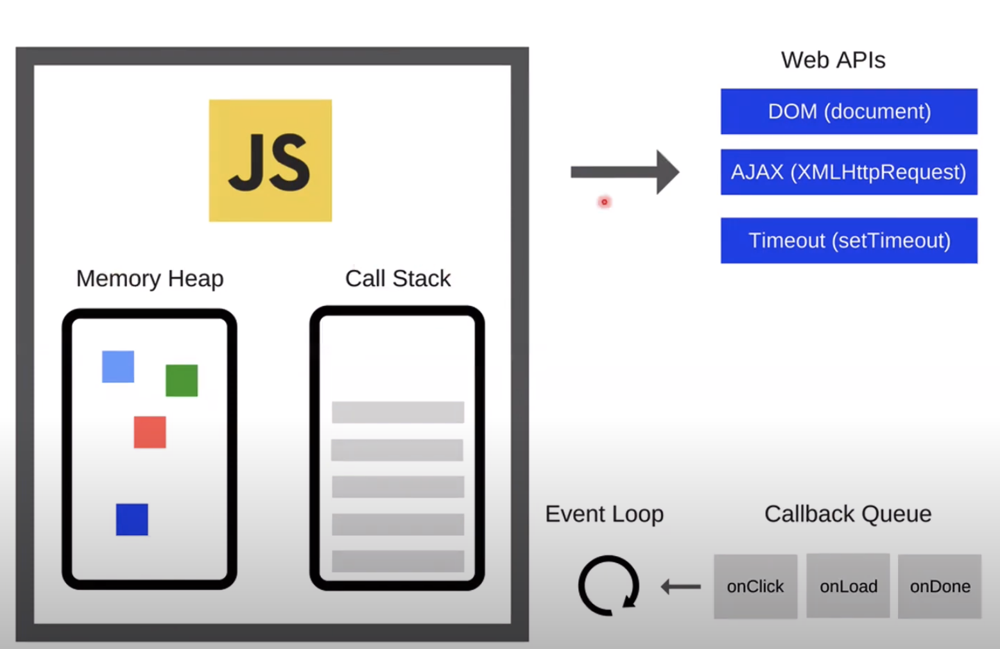
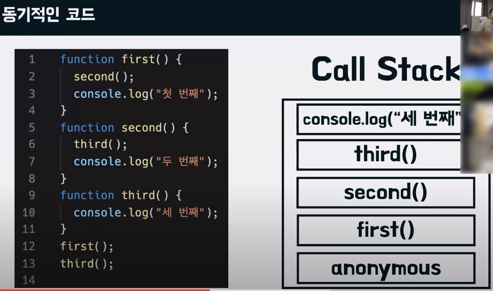
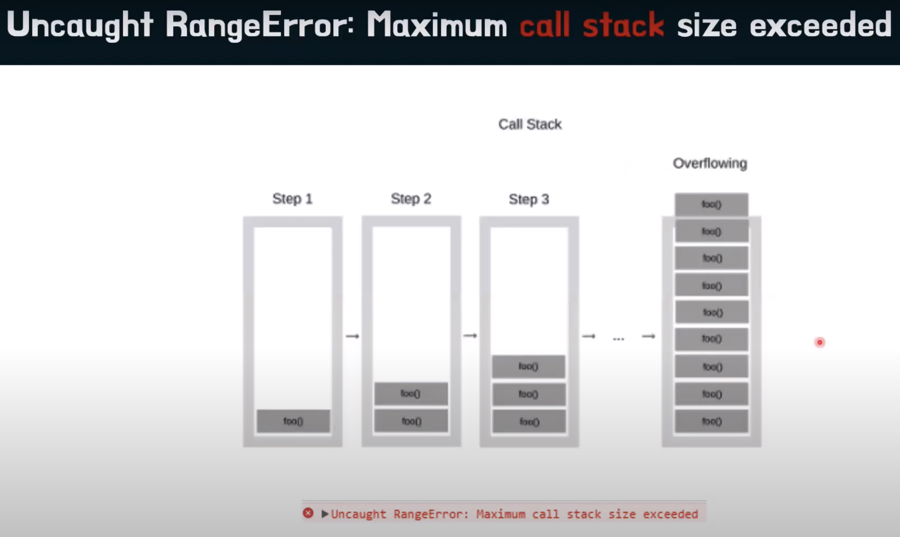
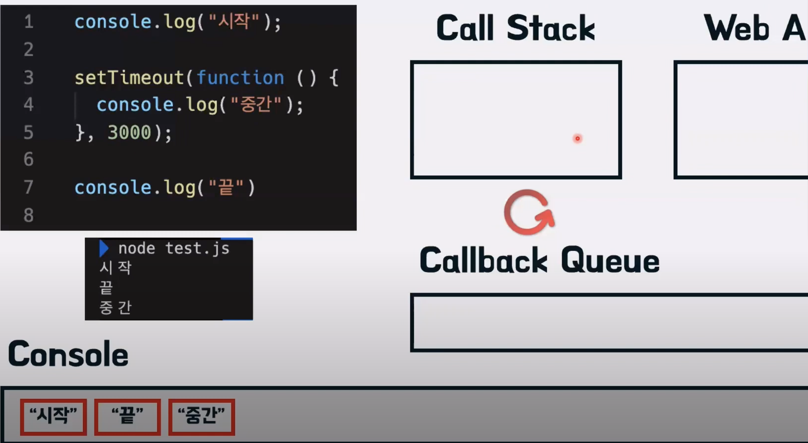
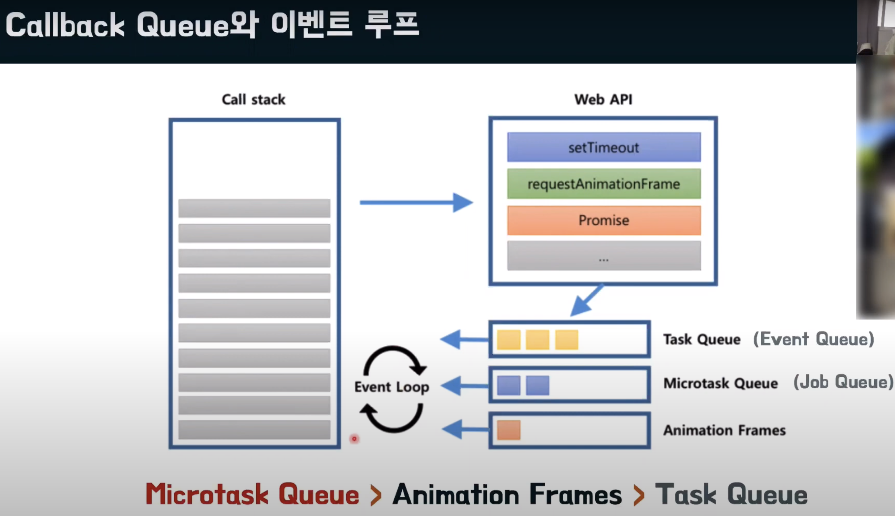

# 자바스크립트 동작원리

## v8엔진의 구조



- 왼쪽은 `v8엔진`의 구성
- 오른쪽 상단은 `Web APIs`는 비동기 처리를 지원해주는 API들

### Memory Heap

- 메모리 할당이 일어나는 곳

> Heap이란? 구조화되지 않은 넓은 메모리 영역 (선언한 변수,함수,객체 등이 담긴다)

### Call Stack

> 함수가 호출되는 순간에 Call Stack에 해당 함수가 담김

- 실행될 코드의 한 줄 단위로 할당되는 곳
- 자바스크립트는 인터프리터로 동작하기 때문에 한 줄단위로 코드를 해석하고 실행한다

### Web APIs(Node에서는 백그라운드로 설명된다)

- 비동기 처리를 담당한다

### Callback Queue

- `Task Queue`, `Event Queue` 등 다양한 형태로 설명된다
- 비도기 처리가 끝난 후 실행되어야 할 `콜백 함수`가 차례대로 할당된다

### Event Loop

- `Queue`에 할당된 함수를 순서에 맞춰 `Call Stack`에 할당해준다

## 동기적인 코드(Call Stack만으로 동작해보기)



### Q. 다음 코드의 실행결과 예측해보고 결과 비교해보기

```js
function first() {
  second();
  console.log("first");
}
function second() {
  third();
  console.log("second");
}
function third() {
  console.log("third");
}

first();
third();
```

## Call stack이 가질수있는 이론적인 에러

> 브라우저 or 엔진마다 callstack의 한계가 다르다. 일반적으로 1만개, chrome의 경우 12만개 라고한다



## 비동기적인 코드

### Q. 다음코드의 실행 결과를 예측하고 비교해보자

```js
console.log("시작");

setTimeout(function () {
  console.log("중간");
}, 1000);

console.log("끝");
```

### 내부 동작 과정



- 동기함수 ➡️ `CallStack` 실행
- 비동기함수 ➡️ `CallStack` ➡️ `WebAPIs(Background)` ➡️ `CallStack Queue` ➡️ `CallStack`

> CallStack Queue 에서 CallStack으로 넘어갈때 반드시 CallStack이 비어있어야 넘어간다(마지막 anonymous까지)

### Q. 다음코드의 실행 결과를 예측하고 비교해보자

```js
console.log("시작");

setTimeout(function () {
  console.log("중간");
}, 0);

Promise.resolve().then(function () {
  console.log("프로미스");
});

console.log("끝");
```

- `Promise`자체는 비동기가 아니다. 하지만 `.then`을 만나는 순간 비동기적으로 동작한다
- `setTimeout` 과 `.then` 은 모두 비동기적으로 동작하여 함께 `CallStack Queue`에 담기지만, `Promise`의 `.then`이 우선순위를 가지기 때문에 먼저 `CallStack`으로 넘어가 실행된다

## Callback Queue Detail

> 왜 Promise가 setTimeout보다 우선순위일까?

A. Callback Queue에서도 세세하게 나누어진다



- Microtask Queue 에는 Promise가 저장된다
- Task Queue 에는 setTimeout이 저장된다.

> Microtask Queue가 우선적으로 탐색되기 때문에 Promise > setTimeout이 되는것이다.

# 🎉 축하합니다 🎉 한층더 나아가시죠!
